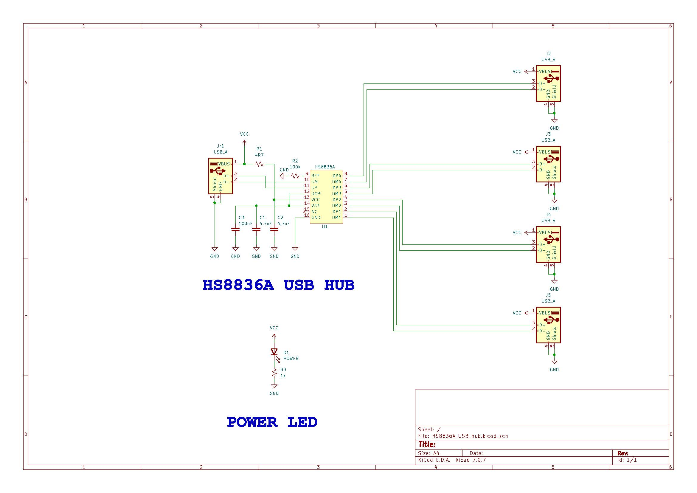
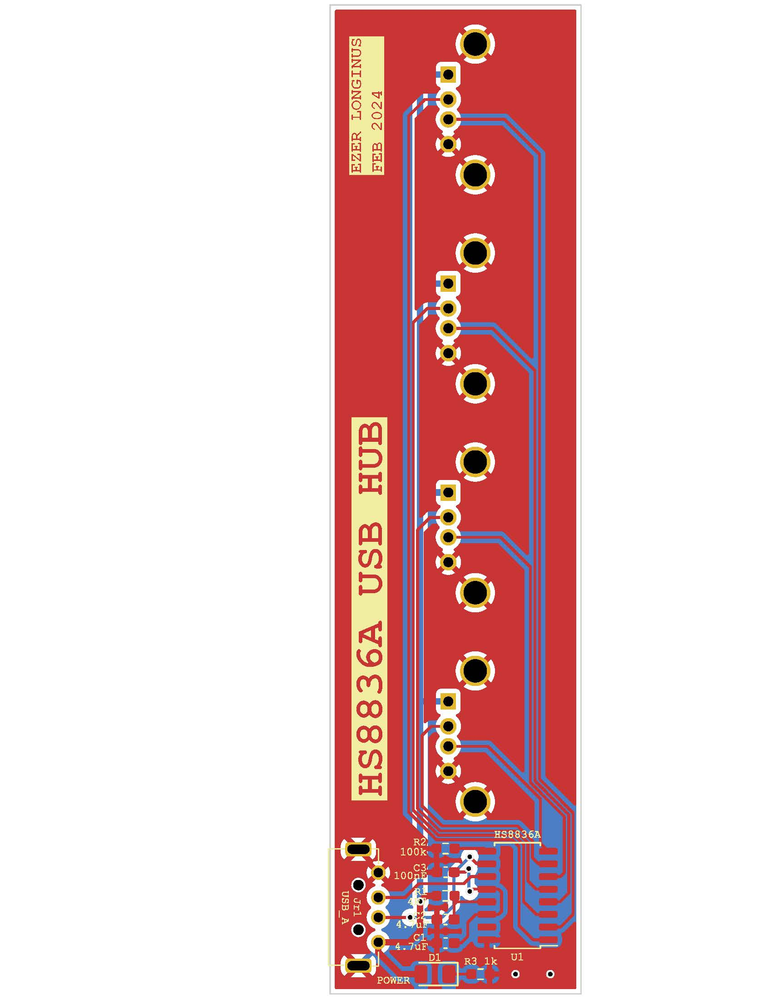

# HS8836A_USB_Hub
Simple usb 2.0 hub using the HS8836A, but designed specifically for mounting directly to the side of my laptop.
This schematic is identical to [Stefan Wagner](https://github.com/wagiminator) schematic at [OSHW Lab](https://oshwlab.com/wagiminator/hs8836-usb-2-0-hub_copy)

## Scematic

## Layout

