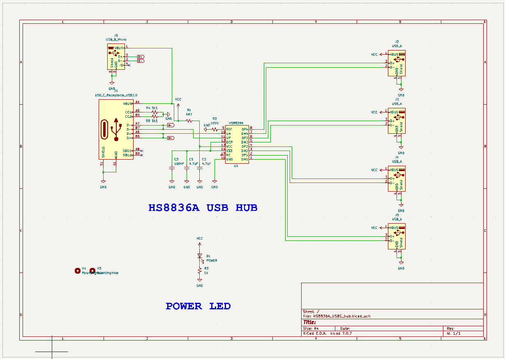
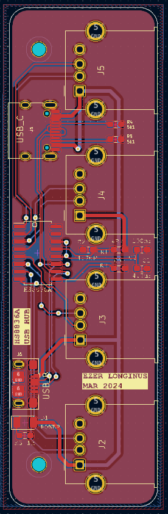

# HS8836A_USB_Hub
Simple usb 2.0 hub using the HS8836A.  There are two designs, one is designed specifically for mounting directly to the side of my laptop, the other is with USB-C or USB Mini connectors and probably the one you'll want to actually look at..  
This schematic is identical to [Stefan Wagner](https://github.com/wagiminator) schematic at [OSHW Lab](https://oshwlab.com/wagiminator/hs8836-usb-2-0-hub_copy)

## Purpose
Originally, and more importantly for me, I wanted to design a slim-ish USB hub that I could connect to the side of my computer, without a cable dangling from it.  The design also needed to allow for airflow from the fans that are next to the USB port on my computer, and not to obstruct the other ports on the other side of the USB.  That being said, I created an addtional design to be a little more universally applicable for others (and myself later).  So likely you'll want to use the [HSS8836_USBC_Hub](hardware/HS8836A_USBC_hub) files instead of the older ones.  The older files are still available, although it's probably not really needed for anyone besides me.

## Scematic

## Layout

## To Do
* Post pictures of the old USB hub
* Populate and Test USBC Hub when boards arrive
* Post pictures of USBC board

